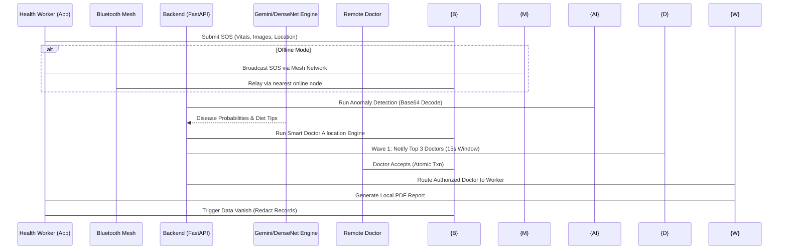

<h1 align="center">BobaHack: AI-Powered Virtual Clinic & Emergency Portal</h1>

<p align="center">
  <strong>Decentralized, AI-Powered Emergency Response & Telemedicine for Low-Connectivity Environments</strong>
</p>

<p align="center">
  
  
  
  
  
  
  
</p>

<hr />

## 🌟 Vision & The Rural Healthcare Challenge
In remote areas, accessing a qualified doctor immediately is often impossible. This application bridges the gap between ground-level Health Workers (nurses, paramedics) and specialized Medical Professionals (doctors). 

When a medical emergency occurs, a verified Health Worker can capture images/video, describe symptoms, and trigger an **SOS Alert**. Our powerful AI acts as a "first-pass" triage assistant, while an intelligent routing engine connects them with the most suitable remote doctor. Even if internet connectivity drops, the distress signal is relayed via a **Bluetooth Mesh Network**.

---

## 🛠️ In-Depth Core Functions & Features

### 1. Emergency SOS Dispatch & Auto-Allocation
- **Function**: Health workers instantly trigger a high-priority SOS by uploading up to 5 images or a 50MB video, typing a symptom description, and tapping "Send SOS".
- **Mechanism**: The app captures live GPS location, plays a 30-second localized emergency siren to alert nearby personnel, and securely queries the backend for available, verified doctors, automatically routing the emergency.

### 2. Offline Bluetooth Mesh Network
- **Function**: A robust fallback system when traditional cellular or WiFi networks fail.
- **Mechanism**: Handled by `bluetoothMeshService.ts`, this peer-to-peer relay bundles the SOS message, live location, verified badge status, and attached images, transmitting them across nearby devices (simulated and routed to Formspree for visualization).

### 3. AI-Powered Skin & Anomaly Detection
- **Function**: Triage assistant identifying potential conditions before the doctor's review.
- **Mechanism**: The React Native frontend securely encodes images into Base64 streams. The FastAPI Python backend (`POST /api/predict-skin`) utilizes deep learning models (DenseNet121 / TinyYOLOv3) to return disease probabilities, confidence scores, and localized diet/health precautions.

### 4. Doctor Response & Patient History Management
- **Function**: Doctors receive real-time notifications on their "Alerts" dashboard.
- **Mechanism**: Doctors review the AI's analysis, accept the case, and issue specific medical directives.

### 5. Local PDF Generation & Secure Data Vanishing (HIPAA Compliant)
- **Function**: Provides patients with a localized diagnosis report while ensuring absolute privacy.
- **Mechanism**: The `PatientReportGenerator` compiles AI analysis, doctor notes, and symptoms into a cleanly formatted PDF directly on the mobile device. Once saved, a trigger is sent to the Supabase backend to **vanish** all sensitive records (Name, Location, Images, Description), replacing them with `[REDACTED FOR PRIVACY]`.

### 6. Health Worker Identity Verification
- **Function**: Prevents unauthorized personnel from accessing sensitive emergency networks.
- **Mechanism**: OCR verification parses uploaded medical Job Cards/IDs to grant a "Verified Badge".

---

## 🗺️ System Architecture



---

## 🏗️ Deep-Dive: Codebase Structure & Data Flow

The repository is modularized into two distinct services:
- `frontend/`: Built with **React Native**, **Expo**, and **TypeScript**. Utilizes NativeWind (Tailwind) for styling. Real-time syncing is handled via Supabase subscriptions.
- `backend/`: High-performance Python microservice on **FastAPI**. It handles heavy computational loads: decoding Base64 image streams, managing secure temporary file processing (`preprocessing.py`), authenticating via JWT, and executing AI inference.

### Database Schema (Supabase)
The backbone of the SOS state machine relies on distinct entities:
- **`DOCTORS`**: Verified professionals and their specialities.
- **`DOCTOR_PRESENCE`**: Real-time tracking (`AVAILABLE`, `BUSY`, `OFFLINE`). Heartbeat required every 30-60 seconds.
- **`SOS_REQUESTS`**: Tracks the incident state (`OPEN` → `ALLOCATING` → `ASSIGNED` → `RESOLVED`).
- **`SOS_CANDIDATES`**: Tracks which doctors received the SOS and their response.

---

## 🏥 Doctor Allocation Engine (Smart Routing)

To ensure rapid and reliable emergency response, the system does **not** simply assign the nearest doctor. Instead, it relies on a sophisticated **Ring-Based Allocation Engine**.

### Comprehensive Scoring Matrix
Doctors are scored (out of 100) before routing:
1. **Speciality (50 pts)**: Exact matches heavily prioritized for HIGH/CRITICAL cases.
2. **Availability & Schedule (20 pts)**: Presence status must be `AVAILABLE` with a recent heartbeat (< 90 seconds).
3. **Distance (20 pts)**: Proximity to the health worker's live GPS coordinates.
4. **Workload (10 pts)**: Doctors with fewer active cases are prioritized to prevent burnout.

### Why "3 Requests at a Time"? (Ring-Based Allocation)
Broadcasting an SOS to every doctor simultaneously causes notification fatigue, confusion, and race conditions. Instead, we use controlled waves:
1. **Wave 1 (Top 3 Candidates)**: The engine evaluates the scoring matrix and notifies only the top 3 highest-scoring, eligible doctors.
2. **The 15-Second Window**: The system waits 15 seconds. The **first valid acceptance wins** the case via a strictly atomic database transaction (`UPDATE ... WHERE status = 'OPEN'`). If one doctor accepts, the others are locked out.
3. **Escalation (Waves 2 & 3)**: If the 15-second window expires without an acceptance, the engine releases Wave 2 (next 5 eligible doctors) and expands the geospatial search radius. If ignored again, it escalates to an administrative emergency channel.

---

## 🚀 Quick Start (Local & Cloud)

### 1. Environment Configuration
Create a `.env` file in the `backend/` directory:
```env
# AI & Infrastructure
GEMINI_API_KEY="your-gemini-key"
SUPABASE_URL="your-supabase-url"
SUPABASE_KEY="your-supabase-key"
```

Create a `.env` file in the `frontend/` directory:
```env
EXPO_PUBLIC_BACKEND_URI="http://localhost:8000"
EXPO_PUBLIC_SUPABASE_URL="your-supabase-url"
EXPO_PUBLIC_SUPABASE_ANON_KEY="your-supabase-anon-key"
```

### 2. Launch the AI Backend Gateway
```bash
cd backend
pip install -r requirements.txt
uvicorn main:app --host 0.0.0.0 --port 8000 --reload
```

### 3. Launch Mobile Frontend (Expo)
```bash
cd frontend
npm install
npx expo start -c
```

---

## 🔒 Security & Medical Compliance
- **Data Privacy**: Patient records are vanished from the cloud immediately upon local PDF generation (`[REDACTED FOR PRIVACY]`).
- **Access Control**: Only OCR-verified Health Workers can issue SOS alerts; only verified Doctors can accept them.
- **AI Boundaries**: AI acts purely as an assistive triage tool. Final medical directives are strictly provided by human professionals.
